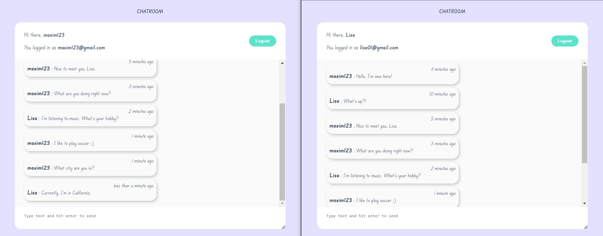

# Live chat / CHATROOM



## 📋 Project Description

Simple chatroom for as many people as you want. You will get messages in real-time so you don't need to refresh your page to get new messages.

In the top bar you can see your nickname and email which you used to sign in.

If you want to check how it works by yourself, it's better to open this app in two windows/bars and log in as 2 different people.

For formatting date received from backend and to show when the message was sent (1 min ago, 1 hour ago, etc.,) I was using date-fns [date-fns-website](https://date-fns.org/).

💻 This project was created via:

- Vue 3 Composition API;
- Firebase for backend;
- date-fns (time formater);

## 🆓 Emails and passwords for tests

If you don't want to sign in new account you can always use one of those:

- Email: maxim123@gmail.com / Password: maxim01
- Email: lisa01@gmail.com / Password: lisa01
- Email: jack007@gmail.com / Password: jack007

🙏 If you use my app don't span too many messages or offensive/unpleasant text, please;

I hope you enjoy using it. If you have any problems or ideas feel free to contact me via:

📱 [Telegram] (@mackseam)
📧 [Gmail] (efremovmaxim95@gmail.com)

## 🚀 Project setup

```
# install dependencies
npm install

# serve with hot reload at localhost:8080
npm run serve
```

### Compiles and minifies for production

```
npm run build
```

### Customize configuration

See [Configuration Reference](https://cli.vuejs.org/config/).
